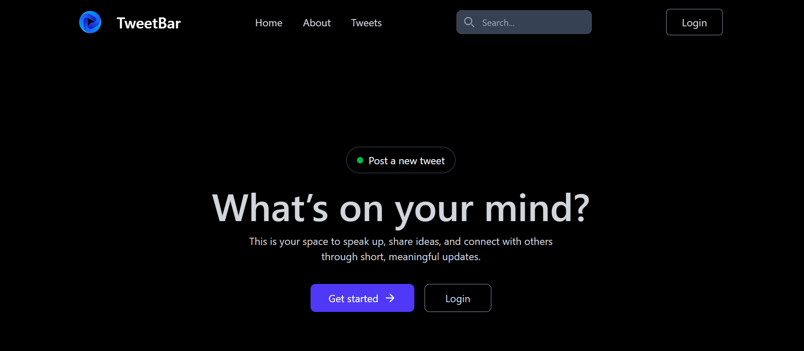
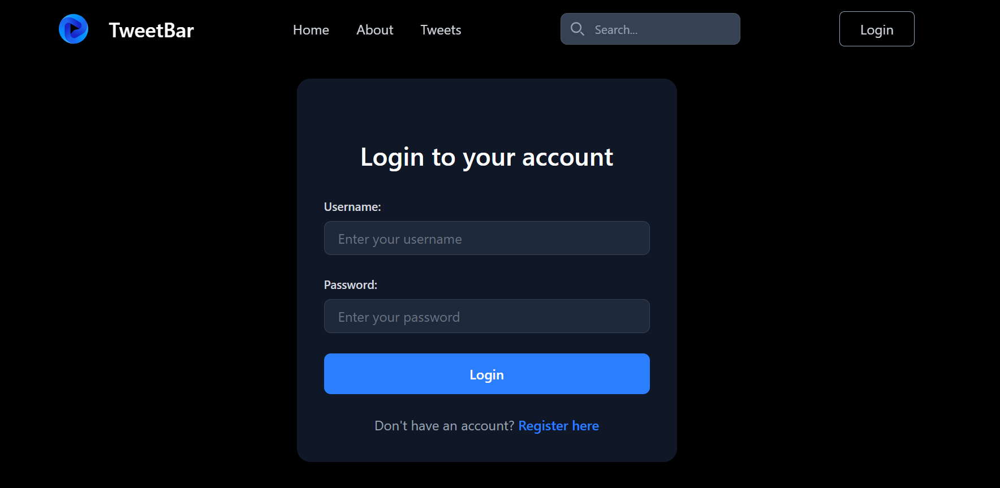
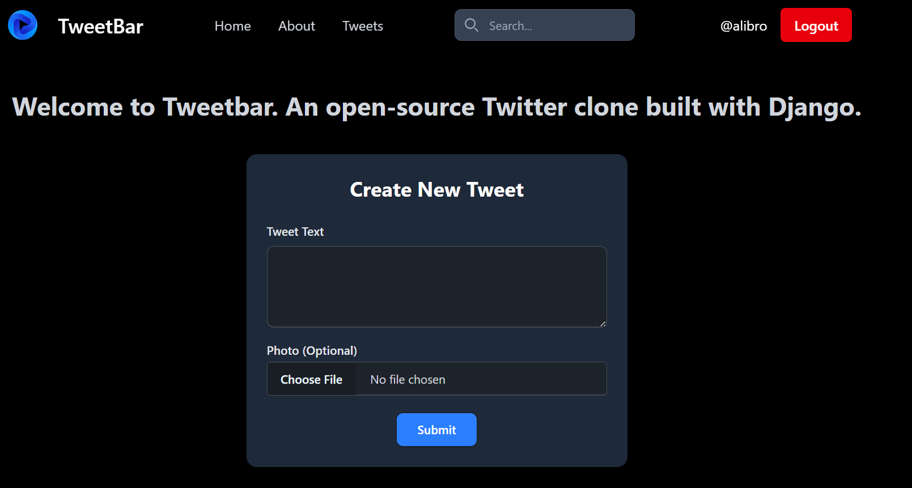
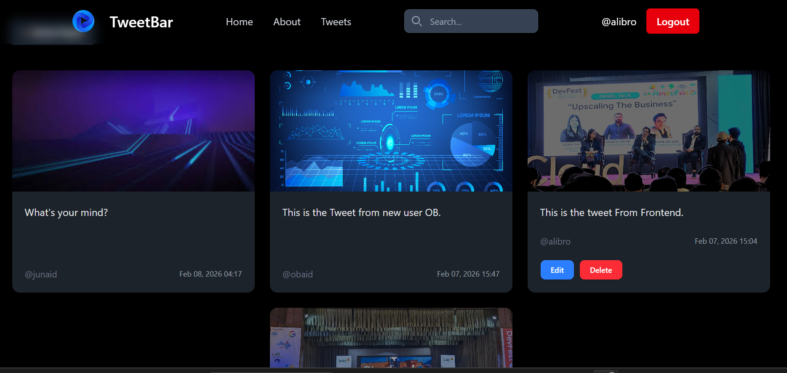
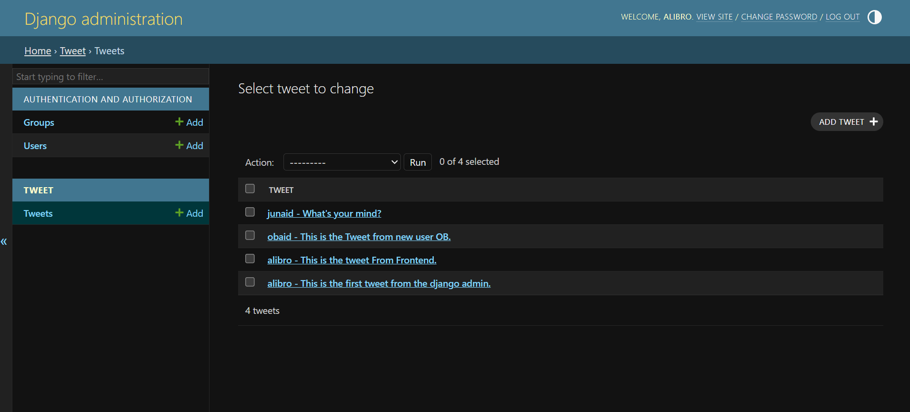

# TweetBar Preview

This file provides a visual overview of the **TweetBar** Django application.

---

## 1. Home

  
*The is the main page of tweet bar.*

---

## 2. User Authentication

### Login Page
  
*Users can log in with their credentials to access the application.*

### Register Page
  
*New users can register to create and manage tweets.*

---

## 3. Create Tweet

  
*Users can write a new tweet and optionally upload an image.*

---

## 4. Edit / Delete Tweet

  
*Users can edit or delete their own tweets.*

---

## 5. Admin Panel

  
*Django Admin interface for managing users and tweets.*

---

